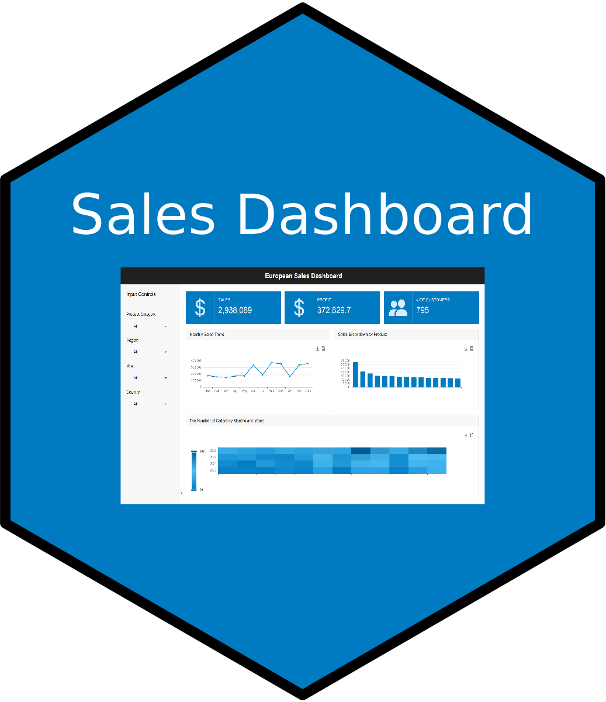
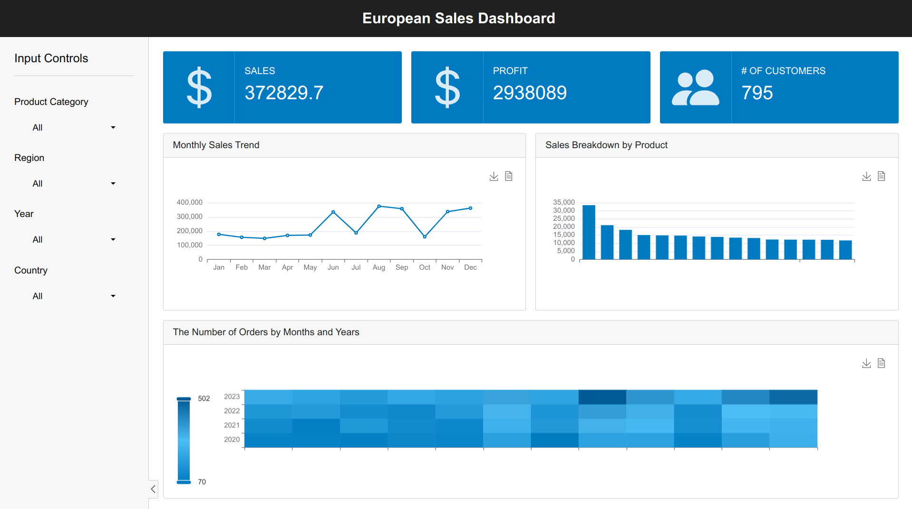

# EU Sales Explorer: Dynamic Shiny Dashboard

The European Sales Dashboard is a Shiny web application for visualizing and analyzing sales data across various parameters, including product category, region, year, and country. It provides interactive input controls, real-time data filtering, and dynamic visualizations to help users gain insights into sales performance.

 
 
 

## Features

- Filter data by product category, region, year, and country.
- View total sales, total profit, and the number of customers in real-time.
- Explore interactive ECharts visualizations for deeper insights.

Access the dashboard in your web browser at [Sales Dashboard](https://aswanijahangeer.shinyapps.io/european-sales-dashboard/).

Here is the [Youtube Video Link](https://youtu.be/N0oYuIwzOyg).

## Technologies Used

- R Shiny.
- bslib package.
- ECharts for interactive visualizations.

## Feedback

Your feedback is highly appreciated as I continue to learn and improve my shiny skills. Feel free to open an issue or provide suggestions for enhancements.

## License

This project is licensed under the MIT License - see the [LICENSE](LICENSE) file for details.
